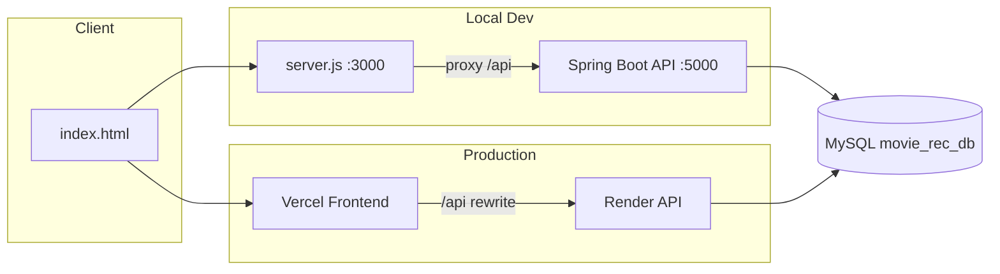

# CineMatch — Movie Recommendation System

A full-stack movie discovery and recommendation platform with user authentication, ratings, watchlists, mood-based suggestions, multi-language browsing, and an admin dashboard. Built as a DBMS mini project with a real MySQL database and 1,000+ movies across Indian regional and international cinema.

**Repository:** [github.com/Meghana30001/Movie-Review-System](https://github.com/Meghana30001/Movie-Review-System)

---

## Tech Stack

| Layer | Technology |
|-------|------------|
| **Frontend** | HTML5, CSS3, Vanilla JavaScript |
| **Backend API** | Java 17 + Spring Boot (`backend/`) — Node.js (`db-server.js`) kept for reference |
| **Database** | MySQL 8.0+ |
| **DB Driver** | `mysql2` |
| **Auth** | Session cookies + PBKDF2 password hashing |
| **Alternate Backend** | Flask + `mysql-connector-python` (`app.py`) |
| **Fonts** | Google Fonts (DM Sans, DM Serif Display) |
| **Movie Metadata** | TMDB (poster URLs, imported data) |
| **Deployment** | Vercel (frontend) · Render (backend API) |

---

## Features

### User
- Register / login / logout with role-based access (`user`, `admin`)
- Browse movies with genre, language, country, and sort filters
- Search movies by title with relevance ranking
- View trending and top-rated movies on Home
- Rate movies (1–5 stars) and write text reviews
- Personal watchlist and watch history
- **For You** recommendations:
  - Content-based filtering
  - Collaborative filtering
  - Popular & trending
  - Mood-based (happy, sad, scared, romantic, etc.)
- Browse by **11 Indian languages** and **14 international languages**
- View movie details, similar movies, and community reviews

### Admin
- Platform statistics (users, movies, ratings, active users)
- Review moderation (view & delete)
- Genre popularity analytics
- Add new movies

### Database (DBMS)
- Normalized schema with foreign keys
- **Views:** `vw_top_rated_movies`, `vw_trending_movies`, `vw_genre_popularity`, `vw_movie_full`
- **Stored procedures:** content-based & collaborative recommendations, similar movies, platform stats
- **Triggers:** auto-update `avg_rating` on ratings insert/update/delete

---

## Architecture



**Local development:** `server.js` serves the frontend and proxies `/api/*` to `db-server.js`.

**Production:** Vercel hosts the static site; Render runs the API; both connect to a cloud MySQL instance.

---

## Project Structure

```
Movie-Review-System/
├── index (1).html        # Frontend SPA (CineMatch UI)
├── server.js             # Local static server + API proxy
├── backend/              # Java Spring Boot API (production on Render)
├── db-server.js          # Legacy Node.js API server
├── db-config.js          # Database & language group config
├── db-auth.js            # Password hashing utilities
├── movie-utils.js        # Search, dedup, poster helpers
├── mood-profiles.js      # Mood → genre classification
├── start.js              # Starts frontend + backend together (local dev)
├── setup-database.js     # DB setup & seed password script
├── fix-posters.js        # Repairs broken TMDB poster URLs
├── render.yaml           # Render deployment blueprint
├── app.py                # Flask backend (alternative)
├── schema.sql            # Database schema, views, triggers, procedures
├── import-data.sql       # Movie seed data
├── import-data-utf8.sql  # UTF-8 movie import
└── package.json
```

---

## Prerequisites

- **Java** 17+ and **Maven** 3.9+ (production API)
- **MySQL** 8.0+ (XAMPP locally, or a cloud provider for production)
- **Git**

Optional:
- **Node.js** 18+ (local dev proxy via `server.js`, or legacy `db-server.js`)
- Python 3 + Flask (if using `app.py`)

---

## Local Setup

### 1. Clone the repository

```bash
git clone https://github.com/Meghana30001/Movie-Review-System.git
cd Movie-Review-System
npm install
```

### 2. Set up MySQL

Start MySQL (e.g. via XAMPP), then create and populate the database:

```bash
# Option A — automated setup script
npm run setup-db

# Option B — manual import via MySQL CLI
mysql -u root -p < schema.sql
mysql -u root -p movie_rec_db < import-data-utf8.sql
```

### 3. Configure environment (optional)

For non-default MySQL credentials, set:

```env
MYSQL_HOST=localhost
MYSQL_PORT=3306
MYSQL_USER=root
MYSQL_PASSWORD=
MYSQL_DATABASE=movie_rec_db
```

### 4. Run the app

```bash
# Full app — frontend :3000 + API :5000
npm run dev

# API only (Java — requires JDK 17 + Maven)
npm run backend:java

# Legacy Node API
npm run backend

# Frontend only (requires API running separately)
npm run frontend
```

Open **http://localhost:3000**

---

## Default Login Accounts

| Email | Password | Role |
|-------|----------|------|
| `megh@gmail.com` | `test123` | User |
| `admin@movierec.com` | `admin123` | Admin |

Run `npm run setup-db` to reset these passwords if login fails.

---

## NPM Scripts

| Command | Description |
|---------|-------------|
| `npm run dev` | Start frontend + backend locally |
| `npm start` | Start legacy Node API |
| `npm run backend:java` | Start Java Spring Boot API (port 5000) |
| `npm run backend` | Start legacy Node.js API server |
| `npm run frontend` | Start static server with API proxy |
| `npm run setup-db` | Initialize DB schema, import data, set passwords |
| `npm run fix-posters` | Fix broken movie poster URLs via TMDB |
| `npm run backend:mock` | Run with JSON mock data (no MySQL) |
| `npm run backend:flask` | Run Flask alternative backend |

---

## API Overview

Base path: `/api`

| Endpoint | Method | Description |
|----------|--------|-------------|
| `/api/health` | GET | Health check |
| `/api/auth/register` | POST | Register user |
| `/api/auth/login` | POST | Login |
| `/api/auth/logout` | POST | Logout |
| `/api/auth/me` | GET | Current user |
| `/api/movies` | GET | Browse / search movies |
| `/api/movies/trending` | GET | Trending movies |
| `/api/movies/top-rated` | GET | Top rated movies |
| `/api/movies/:id` | GET | Movie details |
| `/api/movies/:id/similar` | GET | Similar movies |
| `/api/movies/languages` | GET | All languages with counts |
| `/api/movies/indian-languages` | GET | Indian language groups |
| `/api/movies/international-languages` | GET | International language groups |
| `/api/recommendations/:type` | GET | Content / collaborative / popular / trending |
| `/api/recommendations/mood` | POST | Mood-based recommendations |
| `/api/ratings` | POST | Submit rating & review |
| `/api/watchlist` | GET | User watchlist |
| `/api/watchlist/:id` | POST | Add to watchlist |
| `/api/watch-history/:id` | POST | Mark as watched |
| `/api/user/reviews` | GET | User's reviews |
| `/api/genres` | GET | All genres |
| `/api/admin/stats` | GET | Admin dashboard stats |
| `/api/admin/reviews` | GET | All reviews (admin) |

---

## Deployment

### Frontend → Vercel

1. Import the GitHub repo on [vercel.com](https://vercel.com)
2. Framework preset: **Other**
3. Add `vercel.json` in the repo root:

```json
{
  "rewrites": [
    { "source": "/", "destination": "/index (1).html" },
    { "source": "/api/(.*)", "destination": "https://YOUR-RENDER-URL.onrender.com/api/$1" }
  ]
}
```

4. Deploy

### Backend → Render

1. Create a **Web Service** on [render.com](https://render.com) connected to this repo
2. **Build command:** `npm install`
3. **Start command:** `node db-server.js`
4. Set environment variables:

| Variable | Description |
|----------|-------------|
| `NODE_ENV` | `production` |
| `MYSQL_HOST` | Cloud MySQL host |
| `MYSQL_PORT` | `3306` |
| `MYSQL_USER` | Database username |
| `MYSQL_PASSWORD` | Database password |
| `MYSQL_DATABASE` | `movie_rec_db` |
| `MYSQL_SSL` | `true` (for cloud MySQL) |
| `FRONTEND_URL` | Your Vercel URL (e.g. `https://your-app.vercel.app`) |

5. Deploy — test at `https://your-service.onrender.com/api/health`

> **Note:** Render does not host MySQL. Use a cloud MySQL provider (Aiven, Railway, etc.) and import `schema.sql` + `import-data-utf8.sql`.

---

## Environment Variables

| Variable | Default | Used by |
|----------|---------|---------|
| `MYSQL_HOST` | `localhost` | API |
| `MYSQL_PORT` | `3306` | API |
| `MYSQL_USER` | `root` | API |
| `MYSQL_PASSWORD` | _(empty)_ | API |
| `MYSQL_DATABASE` | `movie_rec_db` | API |
| `MYSQL_SSL` | _(off)_ | API — set `true` for cloud DB |
| `PORT` | `5000` | API |
| `FRONTEND_URL` | _(none)_ | API — CORS & cookies for Vercel |
| `BACKEND_HOST` | `127.0.0.1` | `server.js` proxy |
| `BACKEND_PORT` | `5000` | `server.js` proxy |

---

## Database Schema

**Core tables:** `Users`, `Movies`, `Genres`, `Ratings`, `Watchlist`, `Watch_History`, `Movie_Genres`, `Movie_Cast`, `People`, `Awards`

**Key relationships:**
- Users → Ratings, Watchlist, Watch_History
- Movies → Movie_Genres → Genres
- Movies → Movie_Cast → People

See [`schema.sql`](schema.sql) for the full definition including views, triggers, and stored procedures.

---

## Languages Supported

**Indian (11):** Hindi, Tamil, Telugu, Malayalam, Kannada, Bengali, Marathi, Punjabi, Gujarati, Assamese, Odia

**International (14):** Chinese, English, French, German, Italian, Japanese, Korean, Norwegian, Portuguese, Russian, Spanish, Swedish, Thai, Turkish

---

## Author

**Meghana** — [Meghana30001](https://github.com/Meghana30001)

DBMS Mini Project — Movie Recommendation System
